# The Couch Potato App
## by Sam Revanoor

The Couch Potato [web-app](https://thecouchpotato.herokuapp.com/)

### **Objective**

To create a functioning full-stack application with full-CRUD operations and RESTful routing, using React.js, Node.js, Express.js, Mongo, Mongoose, AJAX and a third party API (TMDb API).
 

-------

### **Background**

For my final project, I decided to create a movie generator app called Couch Potato, designed to find you a movie to watch based on your preferences. You can also add moves to your watch list for later + other fun features! I used the entire MERN stack for this project, along with a third-party API, AJAX and token-based authentication.
 

------

### **Technologies Used**

- React.js
- Node.js
- Express.js
- JavaScript
- CSS
- MongoDB
- Mongoose
- Token-based authentication
- Third-party API
- AJAX
- RESTful routing
- Dotenv
- Bcrypt
- Deployed on Heroku
 

------

### **Screenshots**

Log In page

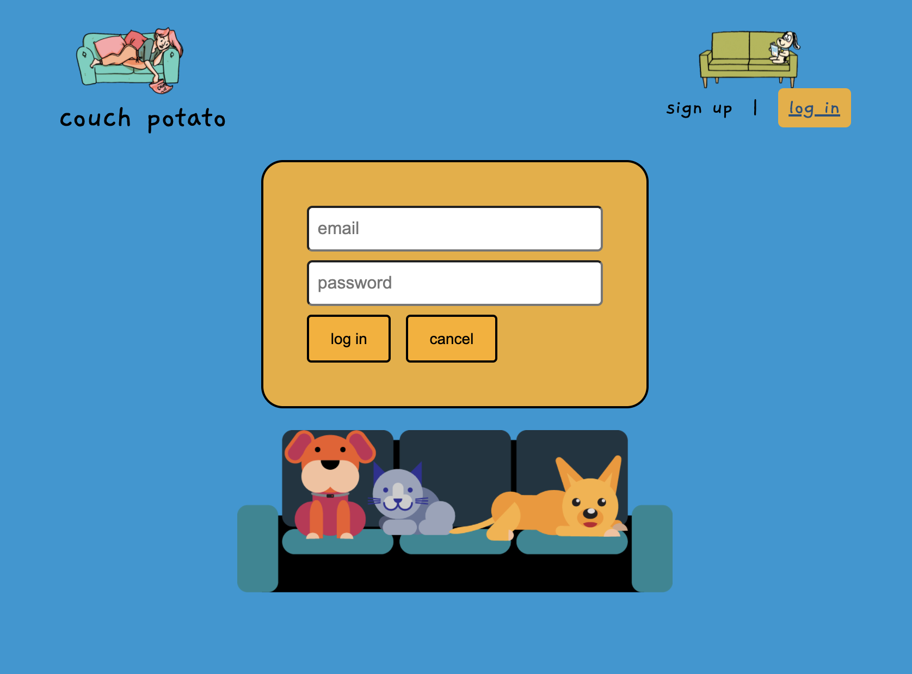
Generator page as a user

 

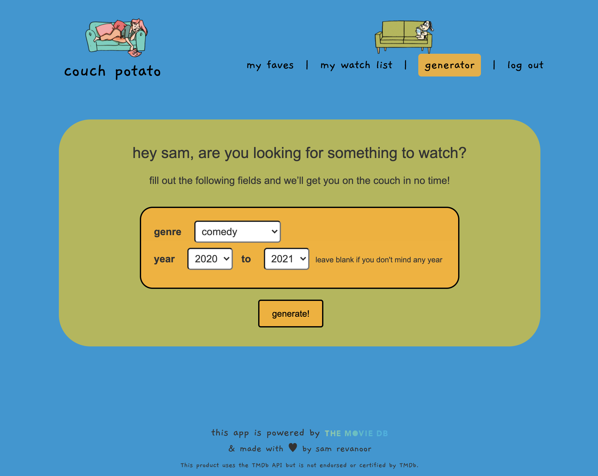
A generated movie

 

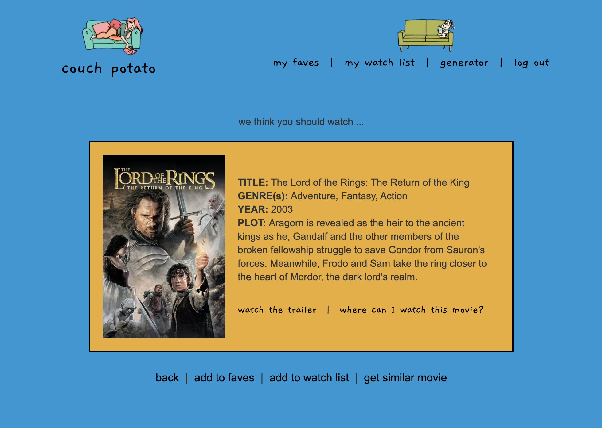
Watchlist page

 

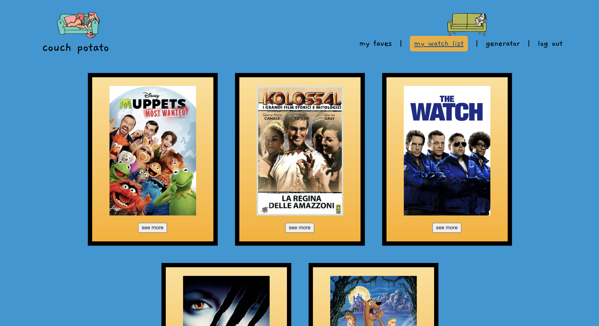
Faves page 

 

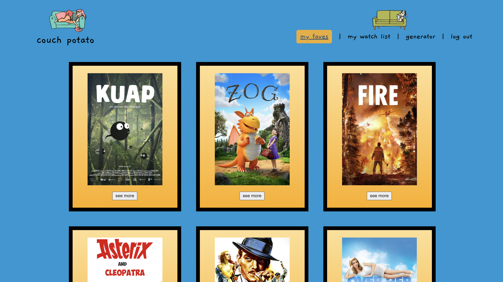
------

### **Getting Started**

You can access my app [here](https://thecouchpotato.herokuapp.com/), and the repo [here](https://github.com/samrevanoor/couchpotato).

I used [this Trello board](https://trello.com/b/rUBdn7QQ/project-4-couch-potato) for my project planning and user stories.

    
Click to expand to view my wireframes.

    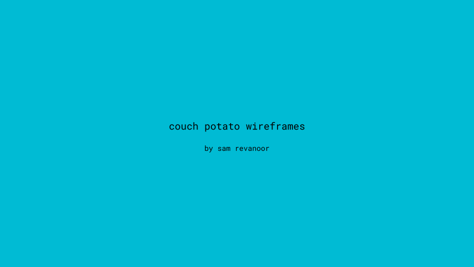 
    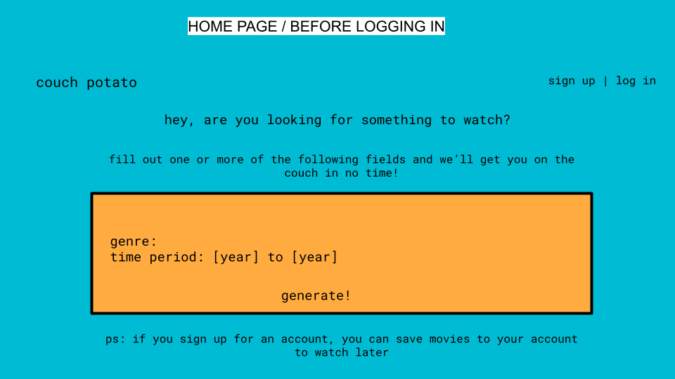 
    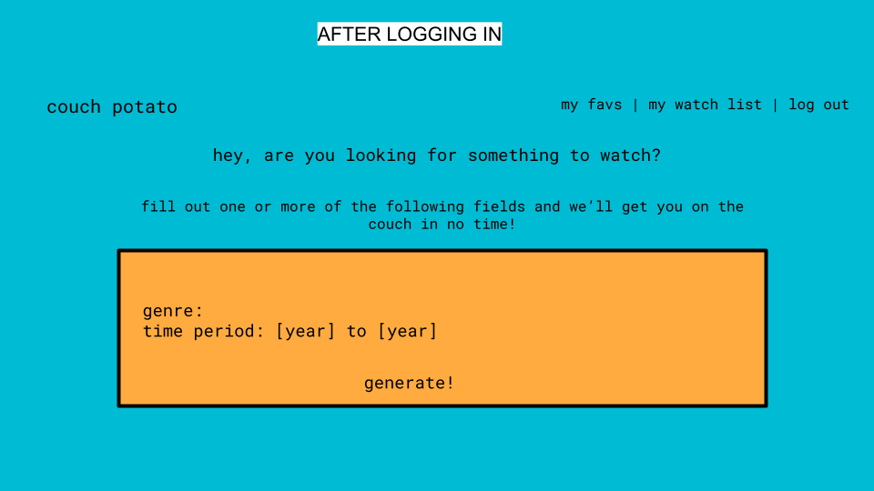 
    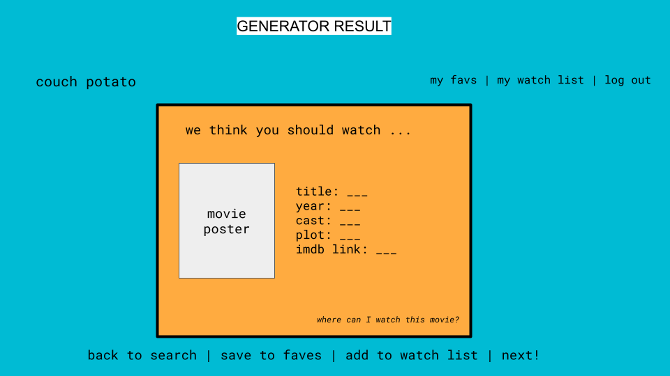 
    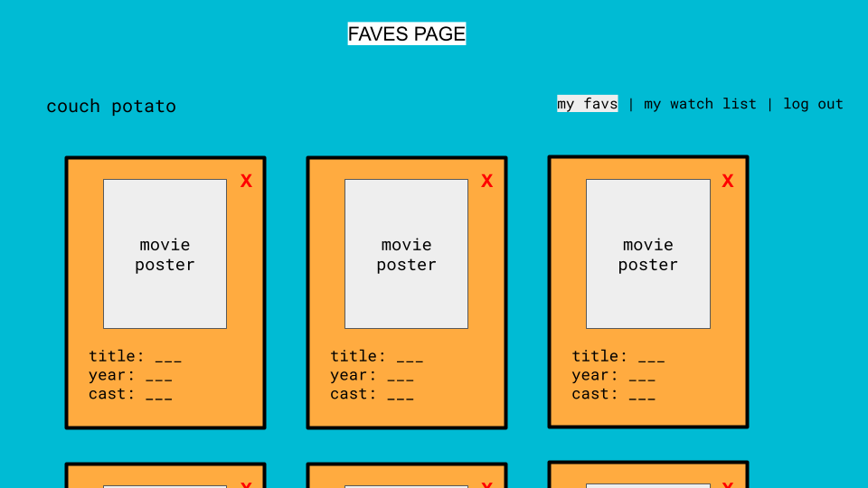 
    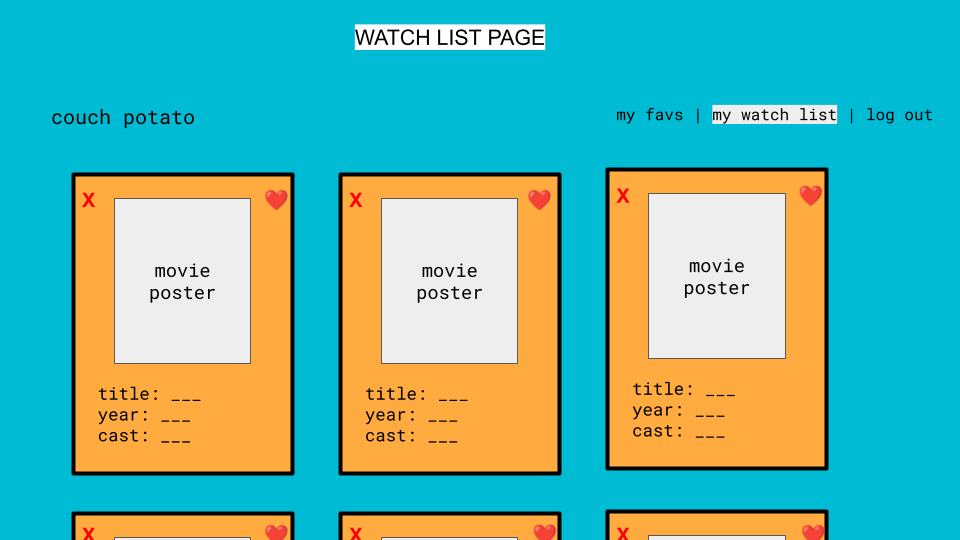 
    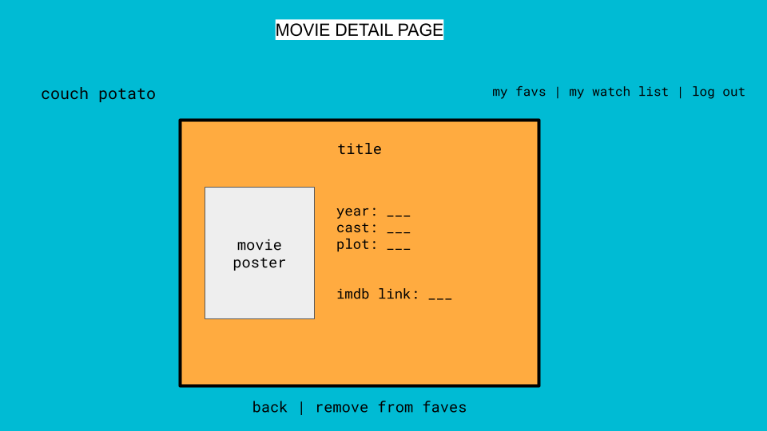 
     
    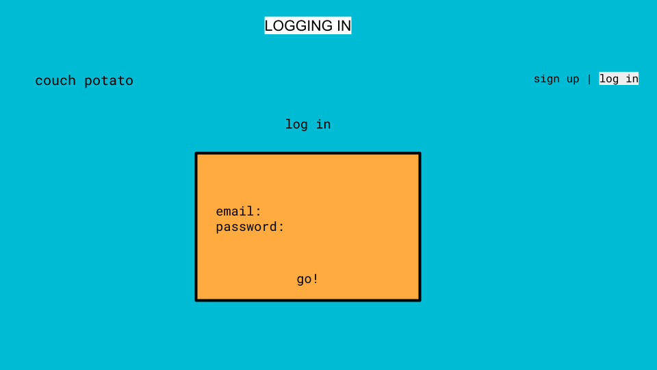 

Here is my ERD:  
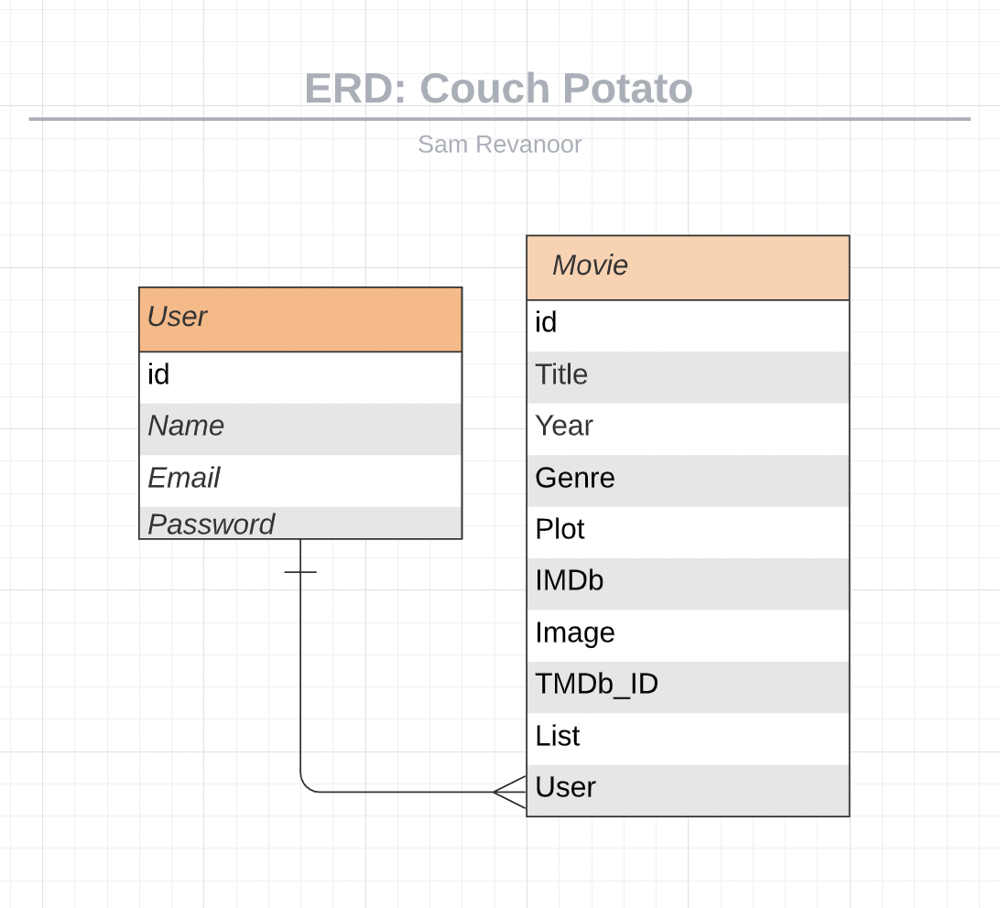

 

------

### **Next Steps**

- Building out filter functionality on the Faves and Watchlist page
 

------

Thank you for reading! Enjoy using the app and please share feedback 😊